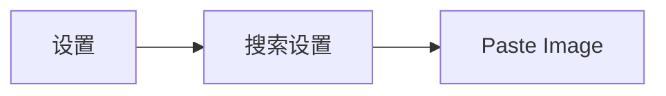
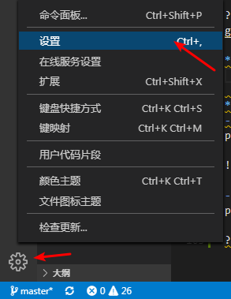
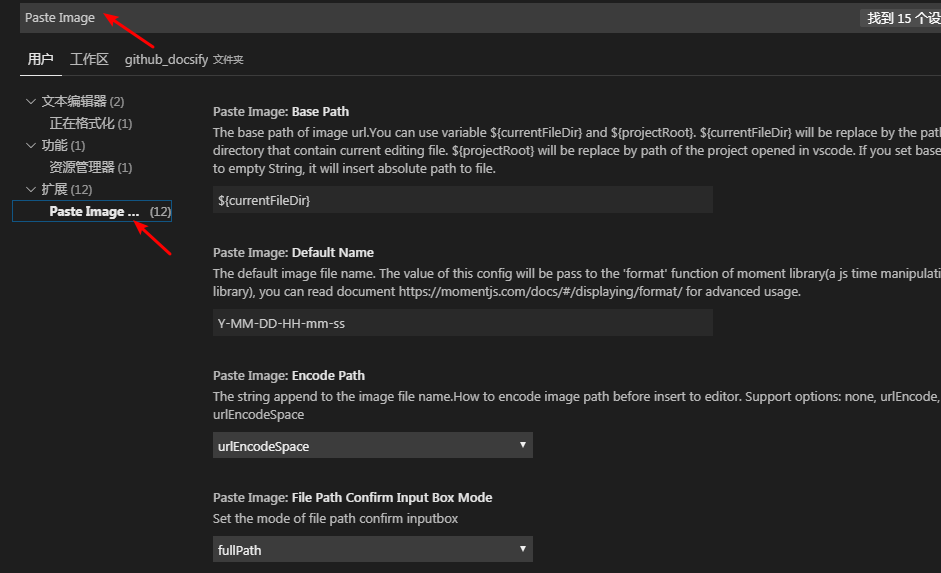

# 环境搭建

?> 首先安装我们必须要用到的工具

## 安装Git

?> Git用于和Github交互使用

- [Git官网](https://git-scm.com/)，默认安装即可

## 安装Node.js

!> docsify-cli和PicGo依赖Node.js

- [Node.js安装参考](https://www.cnblogs.com/zhouyu2017/p/6485265.html)

## 安装PicGo

?> PicGo主要用来自动将本地图片或截图上次至图床网站，并生成MarkDown图片链接，使用`ctrl+v`即可插入图片

- [PicGo官网](https://molunerfinn.com/PicGo/)
- [下载地址](https://github.com/Molunerfinn/picgo/releases)

**设置PicGo**

  

    
     
    
设置图床、链接格式

 

  

  

    
    
    
    
     
    
GitHub Token获取

 

  

  

    
     
    
GitHub图床设置

 

  

   

    
     
    
PicGo设置

 

!> PicGo有CS code插件可以使用

## 使用Paste Image插件（额外）

?> Paste Image是一款VScode编辑器插件，用于Markdown粘贴剪切板图片，并自动生成Markdown链接和自动保存截图。项目地址：https://github.com/mushanshitiancai/vscode-paste-image

**配置文件**

**基础配置**`
- 图片路径  
pasteImage.path: `${projectRoot}/docs/img`

!> `${projectRoot}`为VScode第一个工作区的路径，图片需要放在docs目录下，不然远程无法解析，原因不明。

- 添加图片名前缀
pasteImage.namePrefix: `${currentFileNameWithoutExt}_`

?> `${currentFileNameWithoutExt}`为当前文件名